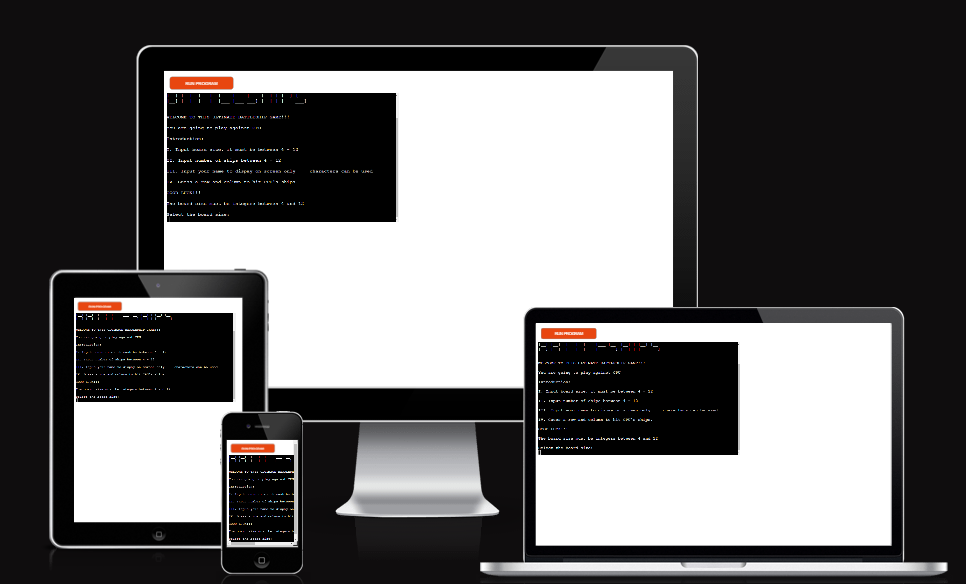
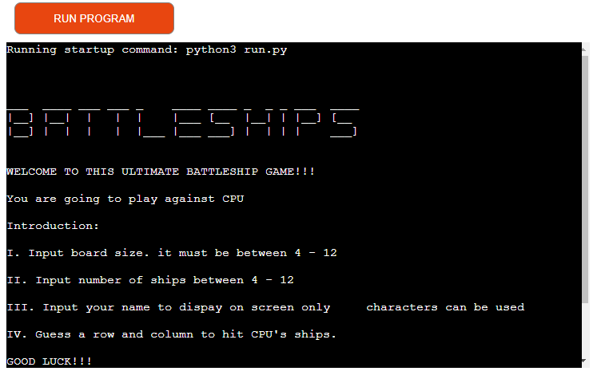
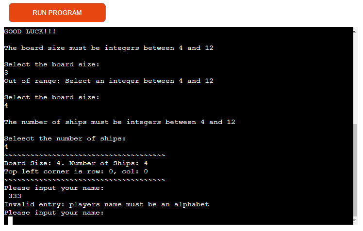
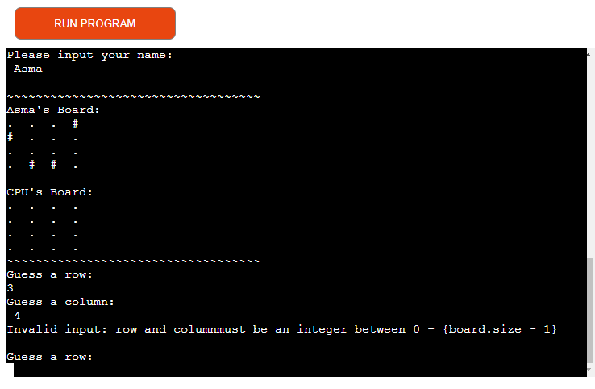
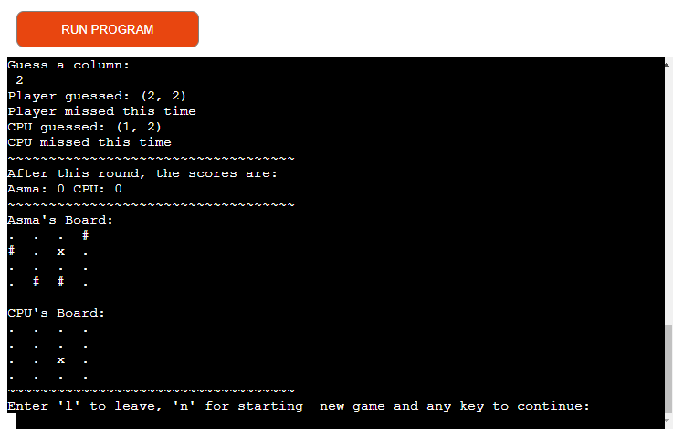
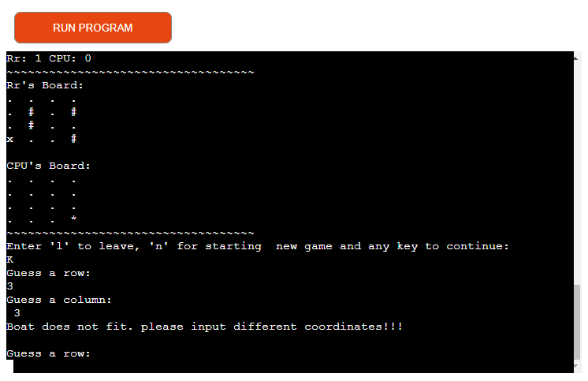
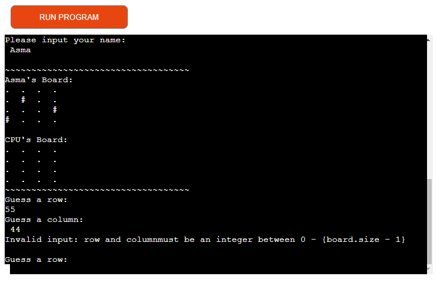

# Battleships Game
**Player vs. CPU**
**About**

Battleship is known worldwide as a pencil and paper game that dates from war I.
It was published by various companies as a pad-and-pencil game in the 1930s and
was released as a plastic board game. The game has spawned electronic versions,
video games, smart devices, apps, and film.
This is a command line battleship game designed to entertain Battleship fans.
This includes Title, Instruction, the possibility to select the size of the board,
and the number of ships, getting the player's name, the scoreboard, player scoreboard,
CPU scoreboard and after each round, players can choose to leave, replay or
continue the game.

**Deployment**

This project was developed manually from the Gitpod command line interface using the CI's 
mock terminal for Heroku
Steps:
- Creating a Heroku Account/App 
- create/login into a Heroku account
- In the setting tab set the buildpacks to python and NodeJs 
- Connect to GitHub search for Github repository
- Deploy Branch
 
**Existing Features**

Introduction

The ability to play against CPU
Get board size and ships as only integer input is allowed between 4 - 12
Get the Player's name as the only alphabet is allowed

The ability to generate a board for players and the system.

A score tracking system that can maintain both CPU and player.

Show the final result and result of each round

Game Control Area where players can make the decision to leave, continue or replay 
the game.

Coordinate matching functionality so that players can't enter the same coordinate.

**Features left to Implement**

To determine a time limitation for the game in each round.

**Data Model**

I considered to use Board Class as my model. The game generate two instances of board 

class for player and CPU. The board class stores the board size, number of ships,

location of the ships, the guesses against that board and details like player's board

or CPU and the player's name. also method to help play the game like print current 

board, add ships method and a take_guess method to add guess and show the result.

**Testing PEP8 Online**

no error were found.

**Solved Bugs**

In the first time I thought it was possible to run python code via (python3 -m 

http.server) whereas it should be run via Terminal.

**Remaining Bugs**

During pushing my code before deploying I forgot to handle this issue cause of time 

constraints and the way of deploying (deploy branch) the issue is just with output 

not in the code I solved the problem in code.

*incorrect*
'print("Invalid input: row and column \ must be an integer between 0 - {board.size - 1}\n")'

*correct*
'print(f"Invalid input: row and column \ must be an integer between 0 - {board.size - 1}\n")'

**Credits**

I highly appreciate slack community and CI for helping me to solve any problems during 
this project.

**Content**

I often look for help in StackOverflow Community when I get stuck.

**Media**

[How to solve battleship interview questions](https://www.youtube.com/watch?v=zSQIGzmcp2I&t=2s)

[python full course](https://www.youtube.com/watch?v=rfscVS0vtbw&t=6s)

[refactoring battleship game in python](https://www.youtube.com/watch?v=u3yo-TjeIDg&t=344s)